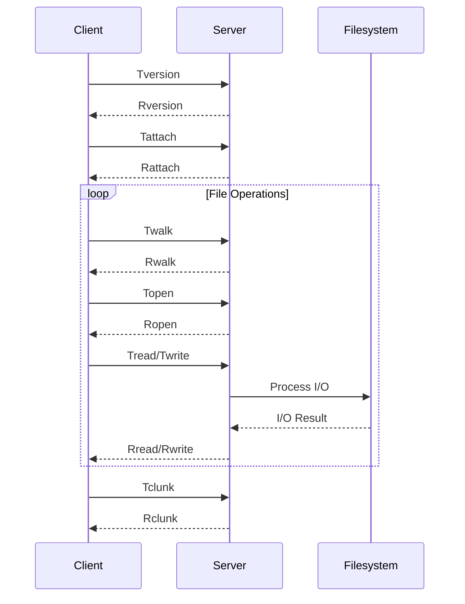

# 9P Protocol Integration

The 9P protocol is the foundation of Froggr's filesystem operations, providing a lightweight and efficient way to implement distributed file systems.

## Protocol Overview



## Key Features

### Message Types
1. **Version & Authentication**
   - Tversion/Rversion
   - Tauth/Rauth
   - Tattach/Rattach

2. **File Operations**
   - Twalk/Rwalk
   - Topen/Ropen
   - Tread/Rread
   - Twrite/Rwrite

3. **Metadata Operations**
   - Tstat/Rstat
   - Twstat/Rwstat
   - Tclunk/Rclunk
   - Tremove/Rremove

### Protocol Characteristics
- Stateless design
- Simple message format
- Low overhead
- Platform independent

## Implementation

### Filesystem Setup
```rust
// Initialize 9P filesystem
let fs = NineP::new(root_path)?;
```

### Message Handling
```rust
// Example message processing
match message {
    Tmessage::Walk { fid, newfid, wnames } => {
        // Handle walk operation
    }
    Tmessage::Read { fid, offset, count } => {
        // Handle read operation
    }
}
```

## Error Handling

### Common Errors
1. **Protocol Errors**
   - Version mismatch
   - Authentication failure
   - Invalid message format

2. **Operation Errors**
   - Permission denied
   - File not found
   - I/O errors

3. **Connection Errors**
   - Network timeout
   - Connection reset
   - Resource exhaustion

## Performance Considerations

### Optimization Techniques
1. **Message Batching**
   - Combine related operations
   - Reduce round trips
   - Optimize bandwidth usage

2. **Caching**
   - File data caching
   - Directory entry caching
   - Metadata caching

3. **Resource Management**
   - Resource pooling
   - Operation timeouts
   - Resource limits

## Security

### Security Measures
1. **Authentication**
   - User verification
   - Access control
   - Capability management

2. **Transport Security**
   - Optional encryption
   - Message integrity
   - Secure channels

3. **Permission Management**
   - File permissions
   - Directory access
   - User mapping

## Best Practices

1. **Protocol Usage**
   - Follow 9P specifications
   - Handle all message types
   - Implement proper error handling

2. **Performance**
   - Optimize message handling
   - Implement caching
   - Monitor resource usage

3. **Security**
   - Implement authentication
   - Validate input
   - Manage permissions

## Troubleshooting

Common issues and solutions:

1. **Protocol Issues**
   - Check message format
   - Verify protocol version
   - Review error responses

2. **Performance Problems**
   - Monitor message patterns
   - Check resource usage
   - Optimize operations

3. **Access Issues**
   - Verify permissions
   - Check authentication
   - Review access control

## See Also

- [Mount Operations](./mount-operations.md)
- [Bind Operations](./bind-operations.md)
- [Session Management](./session-management.md) 