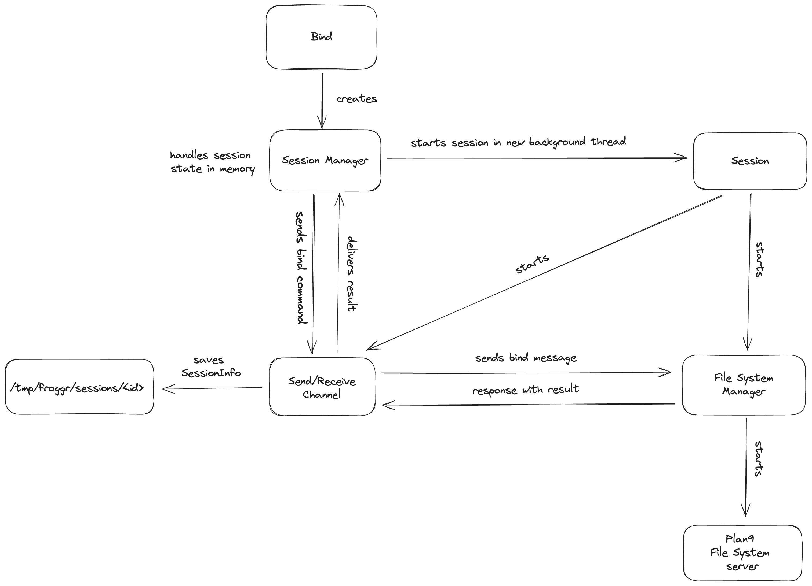

# Bind Operation Design

The bind operation is one of the fundamental mechanisms in Froggr's namespace management system. It allows for dynamic modification of the filesystem view by overlaying directories and files.

## Process Overview

The bind operation follows a specific process flow:

1. **Request Initiation**
   - Client sends bind request with source and target paths
   - Bind mode is specified (Replace, Before, After, Create)

2. **Validation**
   - Source path existence check
   - Target path validation
   - Permission verification
   - Mode-specific requirements check

3. **Namespace Update**
   - Current namespace state is preserved
   - New binding is created according to specified mode
   - Namespace tree is updated
   - Changes are atomically applied

4. **State Management**
   - Session state is updated
   - New binding is recorded
   - State is persisted to disk
   - Recovery information is saved

5. **Completion**
   - Success/failure status is determined
   - Client is notified of result
   - Namespace becomes immediately consistent

## Key Design Aspects

### Atomicity
- All bind operations are atomic
- Namespace remains consistent during updates
- Failures result in complete rollback

### Isolation
- Each session maintains independent bindings
- Changes don't affect other sessions
- Namespace modifications are session-local

### Persistence
- Bindings are recorded in session state
- State is saved in /tmp/proc/<pid>
- Recovery is possible after crashes
- Clean session termination removes state

### Flexibility
- Multiple bind modes supported
- Dynamic namespace modification
- Runtime configuration possible
- Stackable directory views

This design ensures that bind operations are reliable, predictable, and maintainable while providing the flexibility needed for complex namespace configurations. 