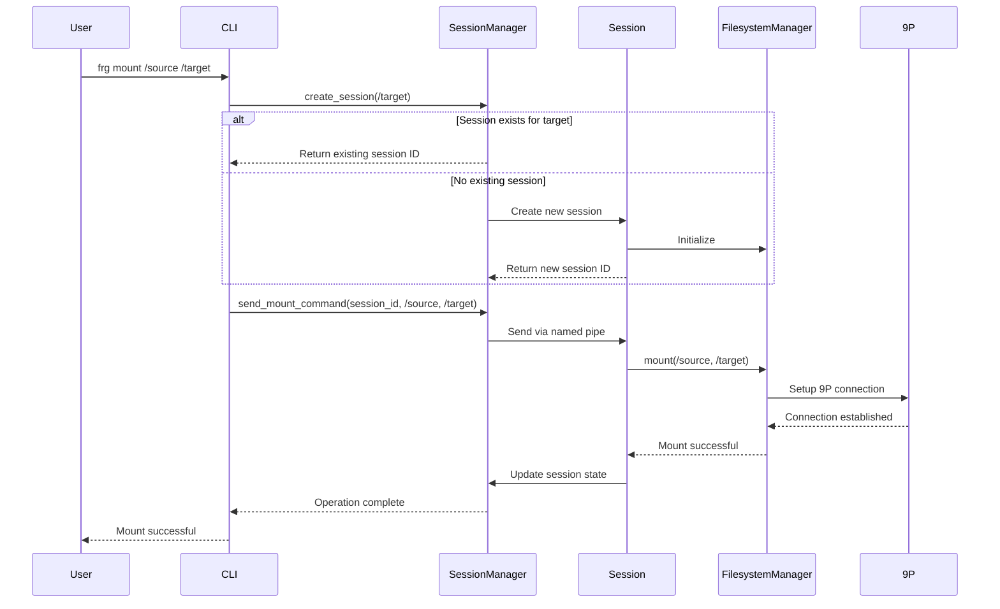

# Mount Operation Design

The mount operation is a core functionality in Froggr that enables attaching directories into the filesystem hierarchy using the 9P protocol.

## Process Overview



## Key Components

### Session Management
- Each mount operation is associated with a session
- Sessions can be reused for the same target directory
- Session state persists mount information
- Clean session termination unmounts all directories

### 9P Protocol Integration
- Uses 9P protocol for filesystem operations
- Supports remote and local mounts
- Maintains connection state
- Handles protocol-specific messaging

### Mount Points
- Target directory becomes a mount point
- Source directory content becomes accessible
- Permissions are preserved
- Path resolution follows mount hierarchy

## Usage Examples

### Basic Mount
```bash
# Mount a local directory
frg mount /source/dir /mount/point

# Mount with custom node identifier
frg mount /source/dir /mount/point custom-node
```

### Common Use Cases
1. **Local Directory Mounting**
   ```bash
   frg mount /home/user/data /mnt/data
   ```

2. **Remote Directory Mounting**
   ```bash
   frg mount remote:/data /mnt/remote-data
   ```

3. **Temporary Mounts**
   ```bash
   frg mount /tmp/source /mnt/temp
   ```

## Error Handling

The mount operation includes robust error handling for common scenarios:

- Target directory doesn't exist
- Source is not accessible
- Permission denied
- Network connection issues (for remote mounts)
- Session creation failures

## Best Practices

1. **Path Selection**
   - Use absolute paths for clarity
   - Ensure target directory exists
   - Verify permissions beforehand

2. **Session Management**
   - One session per target directory
   - Clean up unused sessions
   - Monitor session state

3. **Resource Management**
   - Unmount when no longer needed
   - Don't mount over existing mount points
   - Check available resources

## Implementation Details

### Mount Process Steps

1. **Initialization**
   - Validate paths
   - Check permissions
   - Create/reuse session

2. **Setup**
   - Establish 9P connection
   - Configure mount parameters
   - Prepare target directory

3. **Execution**
   - Perform mount operation
   - Update session state
   - Verify mount success

4. **Cleanup**
   - Handle any errors
   - Update mount registry
   - Log operation result

### State Management

The mount operation maintains state information including:
- Active mount points
- Session associations
- Connection details
- Resource usage

## Troubleshooting

Common issues and solutions:

1. **Mount Failed**
   - Check source directory exists
   - Verify target directory permissions
   - Ensure no conflicting mounts

2. **Session Issues**
   - List active sessions (`frg session -l`)
   - Check session state
   - Try purging dead sessions

3. **Permission Problems**
   - Verify user permissions
   - Check directory ownership
   - Review mount point access

## See Also

- [Bind Operations](./bind-operations.md)
- [Session Management](./session-management.md)
- [9P Protocol](./9p-protocol.md) 