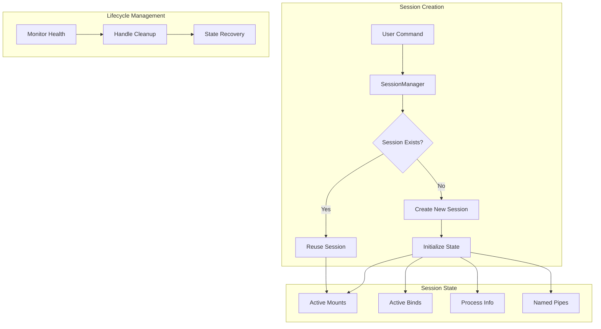

# Session Management

Session management is a critical component of Froggr that handles the lifecycle of filesystem operations and maintains state across multiple commands.

## Architecture Overview



## Session Components

### Session Identity
- Unique session ID (UUID)
- Process ID (PID)
- Root directory path
- Creation timestamp

### State Management
- Active mount points
- Active bind points
- Resource tracking
- Operation history

### Communication Channels
- Named pipes for IPC
- Command routing
- State updates
- Error reporting

## Lifecycle Phases

1. **Creation**
   - Generate session ID
   - Fork process
   - Initialize state
   - Setup communication channels

2. **Operation**
   - Handle mount/bind requests
   - Maintain state consistency
   - Process commands
   - Monitor health

3. **Termination**
   - Clean up resources
   - Unmount filesystems
   - Remove bind points
   - Delete session files

## Command Interface

### List Sessions
```bash
frg session -l
frg session --list
```

### Kill Session
```bash
frg session -k <session-id>
frg session --kill <session-id>
```

### Purge All Sessions
```bash
frg session -p
frg session --purge
```

### Show Session Details
```bash
frg session <session-id>
```

## State Persistence

Sessions maintain state in `/tmp/froggr/sessions/`:
- Session information files
- Named pipes for IPC
- Recovery data
- Operation logs

## Error Handling

### Common Issues
1. **Dead Sessions**
   - Automatic detection
   - Resource cleanup
   - State recovery

2. **Resource Leaks**
   - Periodic validation
   - Orphan cleanup
   - Resource limits

3. **Communication Failures**
   - Retry mechanisms
   - Error reporting
   - Fallback options

## Best Practices

1. **Session Management**
   - Regular session cleanup
   - Monitor active sessions
   - Verify session health

2. **Resource Usage**
   - Limit concurrent sessions
   - Clean up unused sessions
   - Monitor system resources

3. **Error Recovery**
   - Implement proper cleanup
   - Handle crashes gracefully
   - Maintain state consistency

## Implementation Details

### Session Creation
```rust
// Example session creation
let session_manager = SessionManager::new()?;
let session_id = session_manager.create_session(root_path)?;
```

### State Updates
```rust
// Example state update
session.notify_mount_success(source, target)?;
session.notify_bind_success(source, target)?;
```

### Cleanup
```rust
// Example cleanup
session_manager.kill_session(session_id)?;
session_manager.purge_sessions()?;
```

## See Also

- [Mount Operations](./mount-operations.md)
- [Bind Operations](./bind-operations.md)
- [9P Protocol](./9p-protocol.md) 